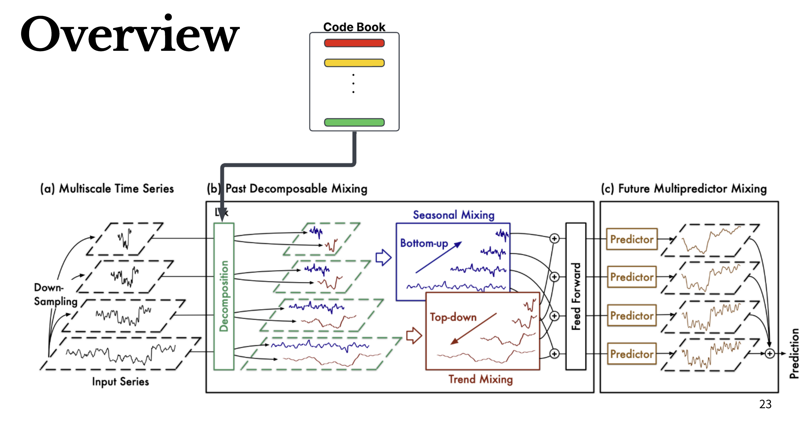
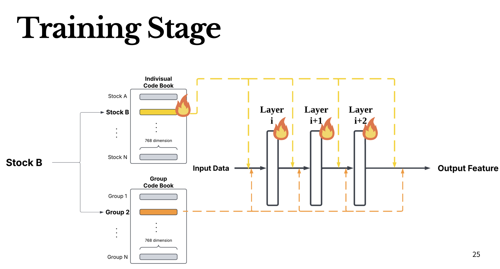
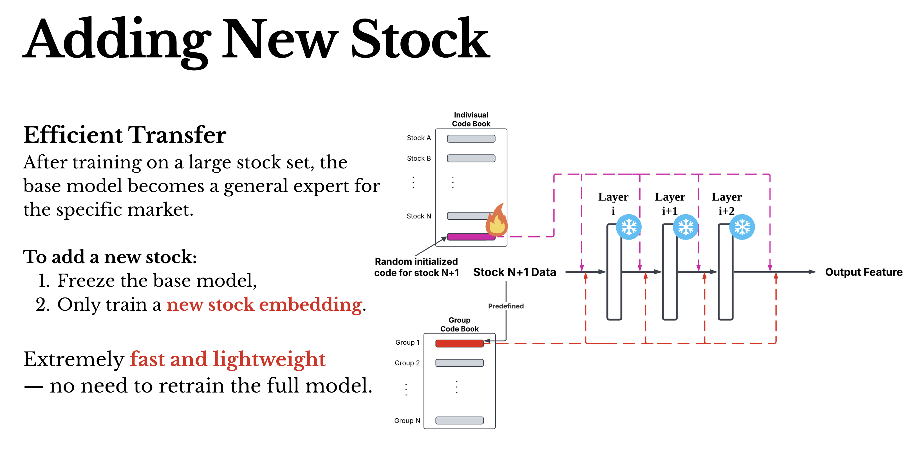
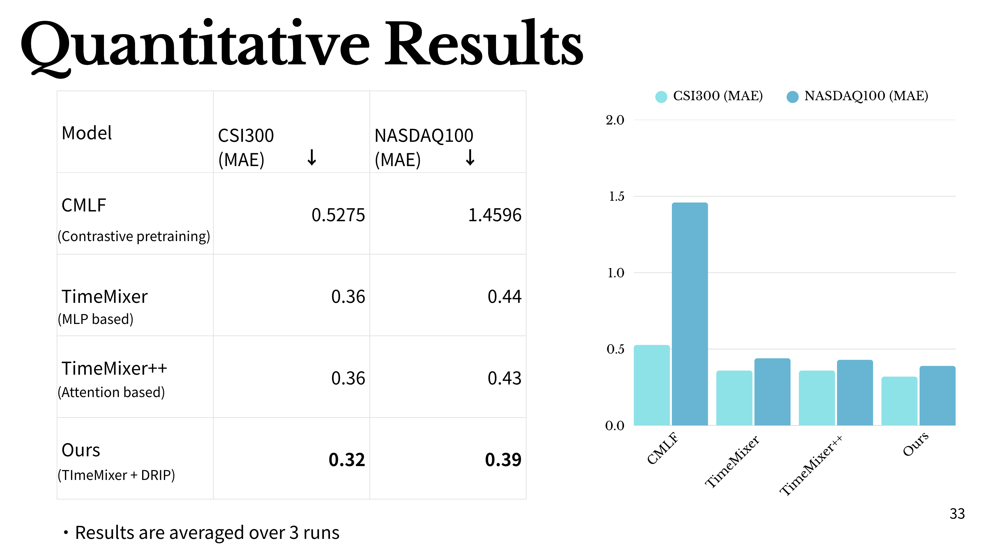

# DRIP: Deep Residual Identifier-aware Prior Codebooks for TimeMixer-based Stock Forecasting


This project extends the powerful [TimeMixer](https://github.com/kwuking/TimeMixer) architecture—originally proposed in the ICLR 2024 paper *"TimeMixer: Decomposable Multiscale Mixing for Time Series Forecasting"*—to support **multi-stock training** and **stock-specific representation learning** via a custom codebook module.

---

<div align="center">

📄 [Original TimeMixer Paper (ICLR 2024)](https://openreview.net/pdf?id=7oLshfEIC2)  
🎥 [Our Slide](https://www.canva.com/design/DAGpSlxdjeE/RQ7LyWuO13d--EPbV1NPCg/edit?utm_content=DAGpSlxdjeE&utm_campaign=designshare&utm_medium=link2&utm_source=sharebutton)

</div>

---

## Table of Contents

- [Introduction](#introduction)
- [Architecture Overview](#architecture-overview)
- [Features](#features)
- [Training Stage](#training-stage)
- [Results](#results)
- [Installation](#installation)
- [Usage](#usage)
  - [Training](#training)
  - [Testing / Prediction Output](#testing--prediction-output)

## Introduction

This implementation modifies the TimeMixer time series forecasting framework to support **multi-stock financial data**. A novel **codebook mechanism** is integrated to encode stock-specific identities during both training and inference, enabling a single model to handle diverse stock behaviors.


## Architecture Overview




## Features

- 🔁 **Modified TimeMixer** with support for multiple stocks  
- 🧠 **Codebook embedding** to distinguish stock identities  
- 🛠️ **Training script** for batch multi-stock forecasting  
- 📝 **Output `.txt` prediction files** for each stock for backtesting  
- 📈 Designed specifically for **financial time series** use cases  


## Training Stage






## Results




## Installation

Clone the repository and install dependencies:

```bash
git clone https://github.com/csienme/Fintech.git
cd TimeMixer
pip install -r requirements.txt
```


## Usage

### 🔧 Training

To train the model on multi-stock time series data using the modified TimeMixer architecture:

```bash
bash ./scripts/DRIP_multiStock.sh
```

### 🧪 Testing / Prediction Output
To generate predictions and save them into .txt files for each stock:

```bash
bash ./scripts/DRIP_test.sh
```
